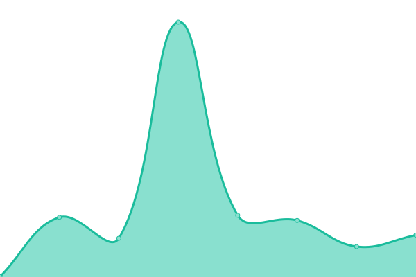

# [📈 Live Status](https://status.hwhelpnow.com): <!--live status--> **🟧 Partial outage**

This repository contains the open-source uptime monitor and status page for [FxllenCode](hwhelpnow.com), powered by [Upptime](https://github.com/upptime/upptime).

With [Upptime](https://upptime.js.org), you can get your own unlimited and free uptime monitor and status page, powered entirely by a GitHub repository. We use [Issues](https://github.com/FxllenCode/FxllenCode/HWHelpNowStatus/issues) as incident reports, [Actions](https://github.com/FxllenCode/FxllenCode/HWHelpNowStatus/actions) as uptime monitors, and [Pages](https://status.hwhelpnow.com) for the status page.

<!--start: status pages-->
<!-- This summary is generated by Upptime (https://github.com/upptime/upptime) -->
<!-- Do not edit this manually, your changes will be overwritten -->
<!-- prettier-ignore -->
| URL | Status | History | Response Time | Uptime |
| --- | ------ | ------- | ------------- | ------ |
|  [Homework Help Now](https://hwhelpnow.com/) | 🟥 Down | [homework-help-now.yml](https://github.com/FxllenCode/HWHelpNowStatus/commits/HEAD/history/homework-help-now.yml) | 

 0ms
     
 | 

<a href="https://status.hwhelpnow.com/history/homework-help-now">0.00%</a>
    

|  [Zoho SalesIQ (Live-Chat)](https://www.zoho.com/salesiq/) | 🟩 Up | [zoho-sales-iq-live-chat.yml](https://github.com/FxllenCode/HWHelpNowStatus/commits/HEAD/history/zoho-sales-iq-live-chat.yml) | 

 434ms
     
 | 

<a href="https://status.hwhelpnow.com/history/zoho-sales-iq-live-chat">100.00%</a>
    

|  [Firebase Hosting](https://firebase.google.com/) | 🟩 Up | [firebase-hosting.yml](https://github.com/FxllenCode/HWHelpNowStatus/commits/HEAD/history/firebase-hosting.yml) | 

 550ms
     
 | 

<a href="https://status.hwhelpnow.com/history/firebase-hosting">100.00%</a>
    

<!--end: status pages-->

[**Visit our status website →**](https://status.hwhelpnow.com)

## 📄 License

- Powered by: [Upptime](https://github.com/upptime/upptime)
- Code: [MIT](./LICENSE) © [FxllenCode](hwhelpnow.com)
- Data in the `./history` directory: [Open Database License](https://opendatacommons.org/licenses/odbl/1-0/)
